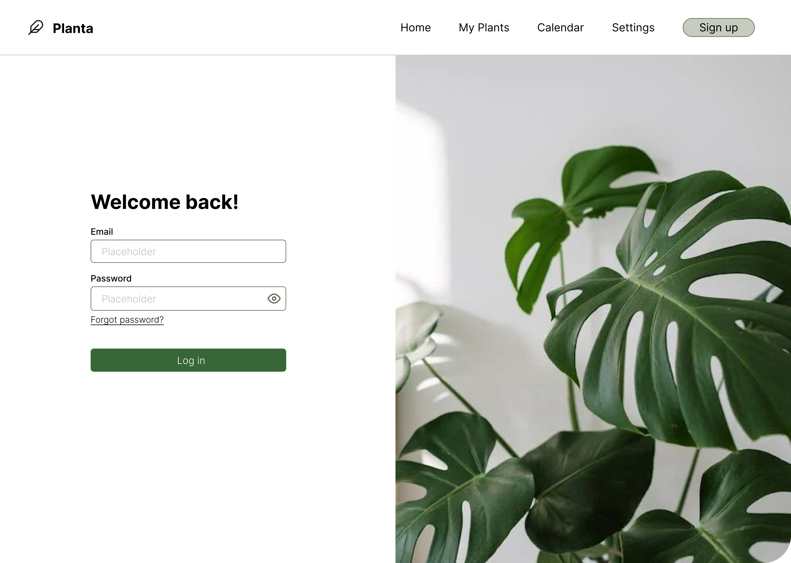
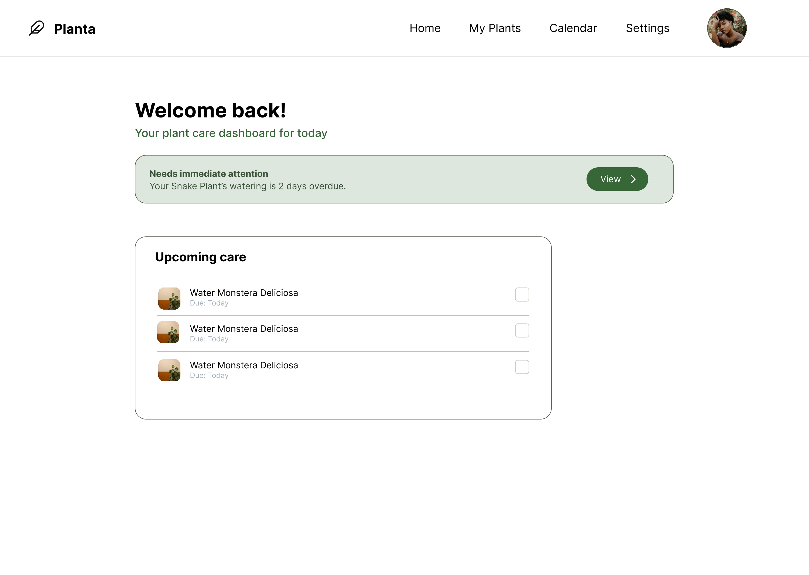
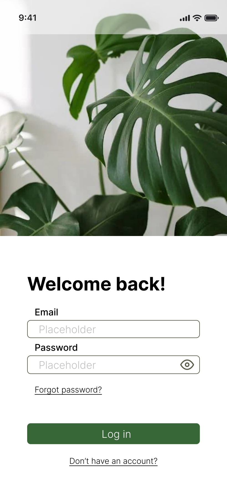
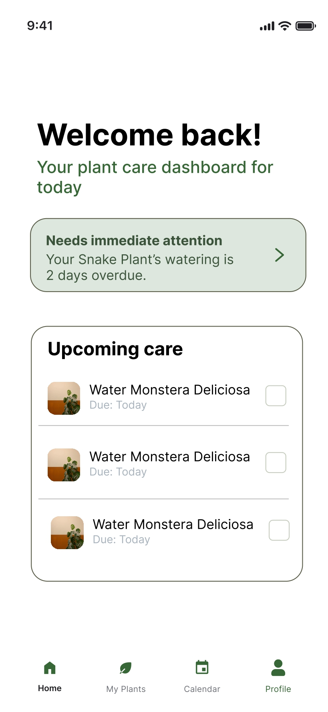
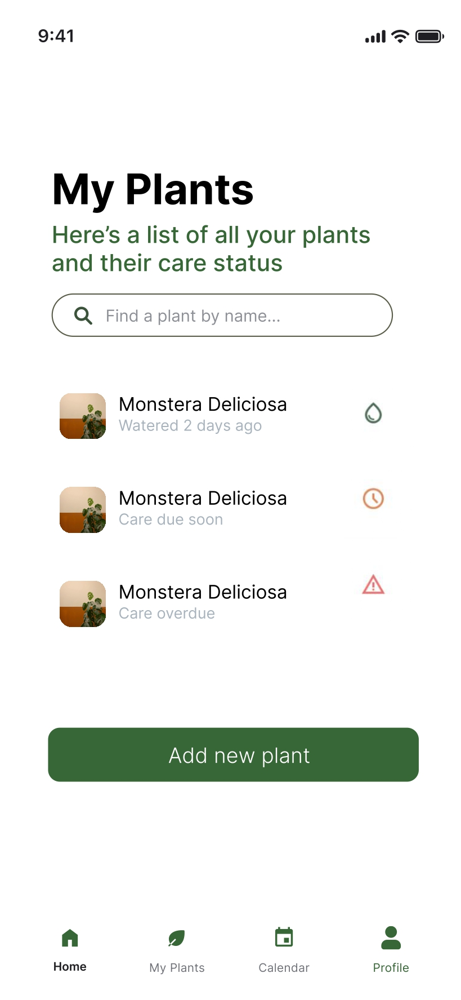
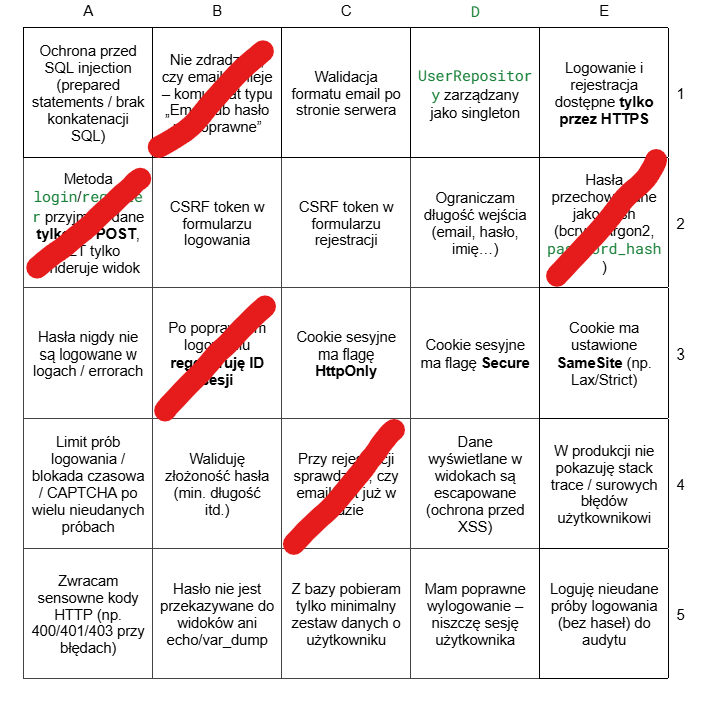
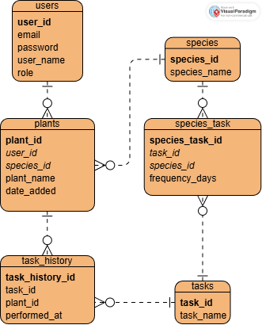

# Planta

Helps you take care of your houseplants!

# UI Design

# Bingo

# Wymagania

- [ ] Dokumentacja w README.md
- [ ] Architektura aplikacji MVC/front-backend, inna
- [x] Kod napisany obiektowo (część backendowa)
- [x] Diagram ERD
- [x] Git
- [x] Realizacja tematu
- [x] HTML
- [x] PostgreSQL
- [x] Złożoność bazy danych
- [ ] Eksport bazy do pliku .sql
- [x] PHP
- [x] Java Script
- [ ] Fetch API (Ajax)
- [x] Design
- [ ] Responsywność
- [x] Logowanie
- [ ] Sesja użytkownika
- [ ] Uprawnienia użytkowników
- [x] Role użytkowników - co najmniej dwie
- [ ] Wylogowywanie
- [ ] Widoki, wyzwalacze, funkcje, transakcje
- [x] Akcje na referencjach (joiny w bazie danych)
- [ ] Bezpieczeństwo
- [ ] Brak replikacji kodu
- [x] Czystość i przejrzystość kodu

## ERD

