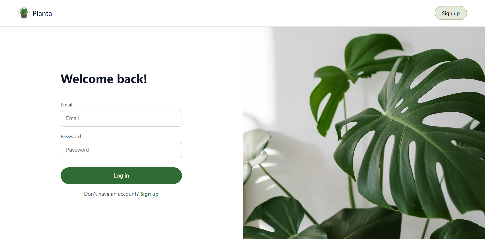
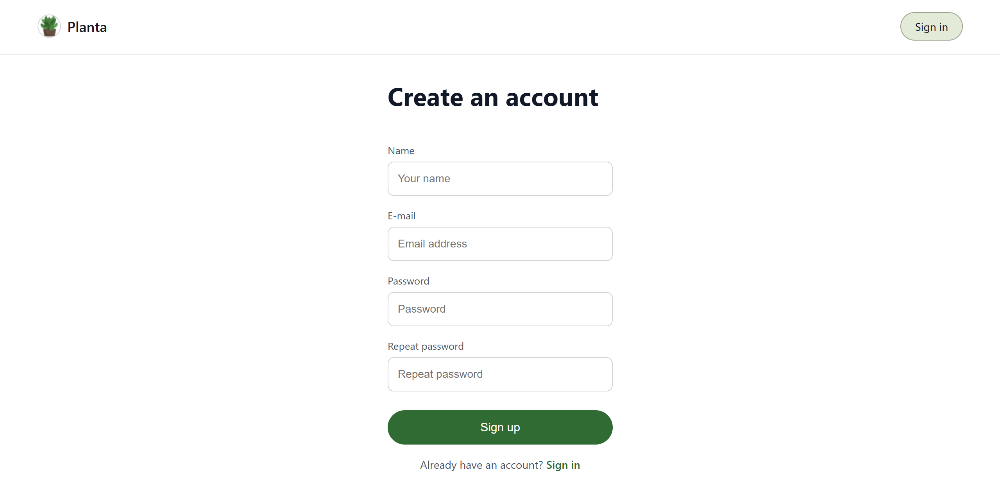
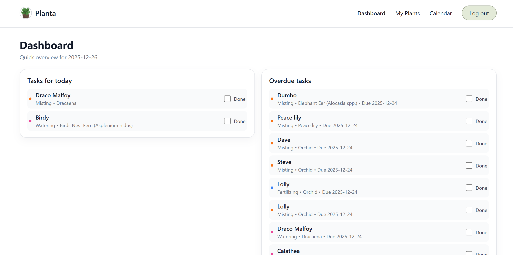
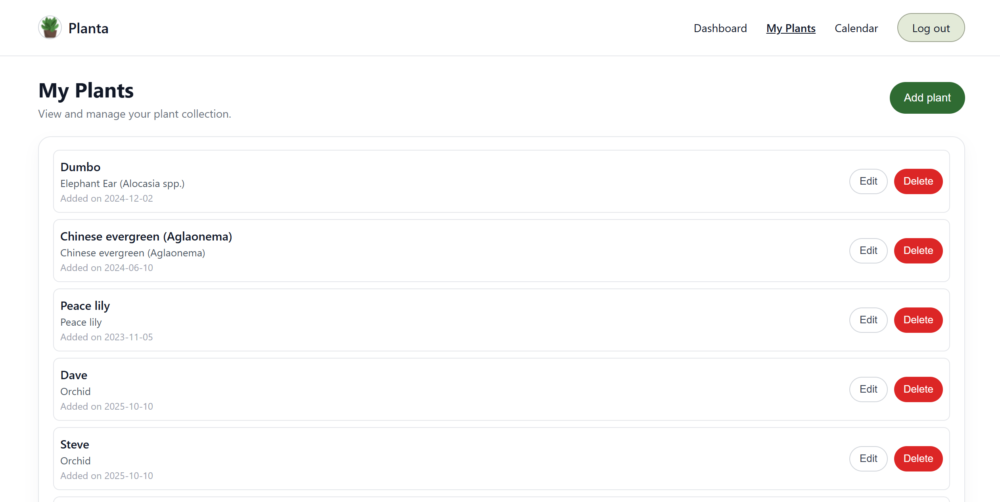
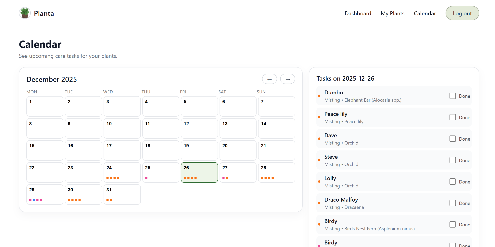
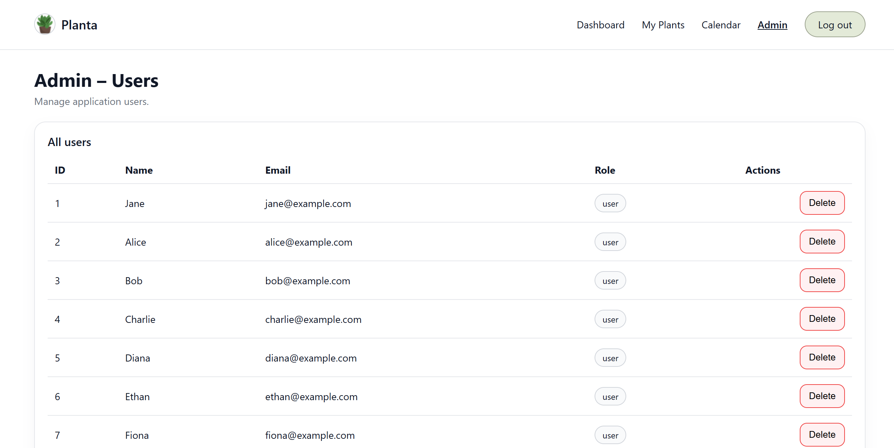
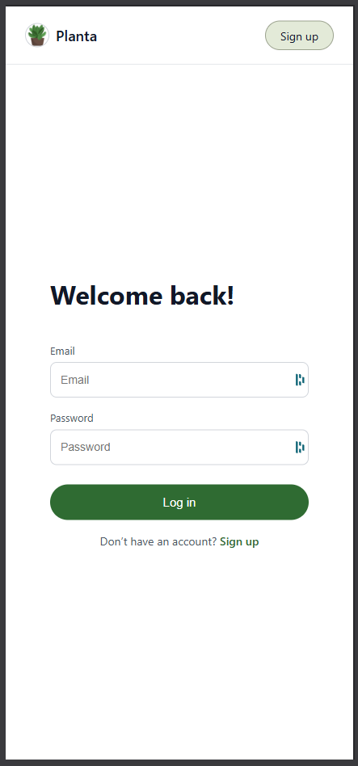
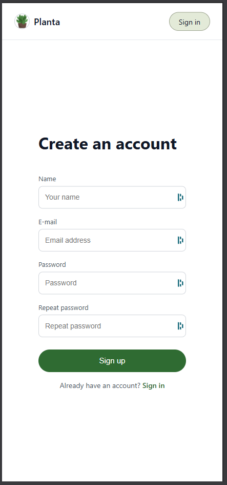
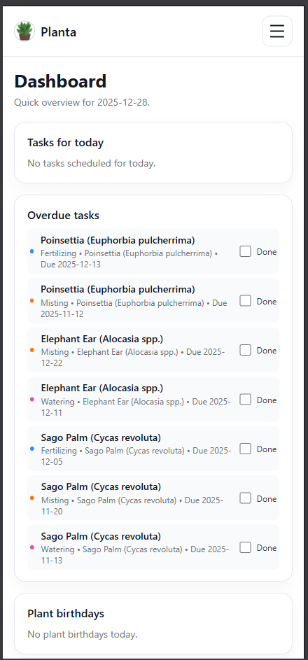
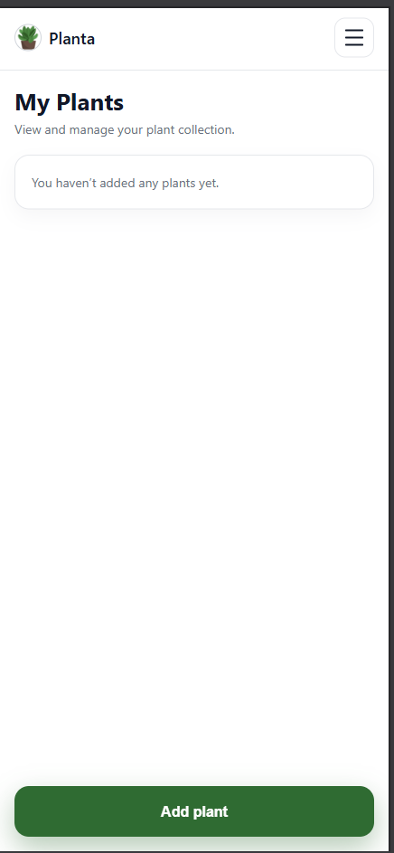

# Planta

## Opis

Planta to aplikacja webowa służąca do zarządzania roślinami oraz planowania i monitorowania zadań pielęgnacyjnych z nimi związanych. Umożliwia użytkownikom dodawanie własnych roślin oraz bieżące śledzenie zadań takich jak podlewanie, nawożenie czy przycinanie.

### Główne funkcjonalności aplikacji:

- Rejestracja i logowanie użytkowników.
- Dodawanie, edycja oraz usuwanie roślin przypisanych do użytkownika.
- Automatyczne planowanie harmonogramu zadań pielęgnacyjnych dla każdej z roślin użytkownika.
- Wyświetlanie harmonogramu zadań pielęgnacyjnych przy pomocy kalendarza.
- Interaktywna lista zadań, umożliwiająca oznaczanie zadań jako wykonane.
- Widok Dashboard, prezentujący zwięzłe podsumowanie najważniejszych zadań na dany dzień.
- Panel administracyjny dostępny wyłącznie dla upoważnionych, umożliwiający zarządzanie użytkownikami aplikacji.

Aplikacja Planta wspiera użytkowników w regularnej i świadomej pielęgnacji roślin, ułatwiając planowanie oraz realizację zadań pielęgnacyjnych.

## Opis implementacji wybranych wymagań

### Architektura aplikacji MVC/front-backend, inna

Struktura aplikacji jest podzielona na warstwy:

- Model: komunikacja z bazą danych, logika zarządzania danymi. Pliki w folderze /src/repository (np. PlantsRepository.php).
- View: prezentacja danych. Pliki w folderze /public/views (np. my-plants.html)
- Controller: zarządza zapytaniami. Pliki w folderze /src/controllers (np. MyPlantsController.php).

### Diagram ERD


### Git

[Link do repozytorium GitHub](https://github.com/matyldadylag/wdpai-2025).

### Fetch API (AJAX)

W [calendar.js](public/scripts/calendar.js):

Użyty jest Fetch API, który wysyła żądanie POST z danymi w postacji JSON.

```
const res = await fetch("/calendar/mark-task-done", {
    method: "POST",
    headers: {
        "Content-Type": "application/json",
        "X-Requested-With": "fetch",
    },
    body: JSON.stringify({ plant_id: plantId, task_id: taskId }),
});
```

W dalszej części kodu odpowiedź z serwera jest odbierana, parsowana jako JSON, sprawdzany jest status operacji (data.ok), interfejs użytkownika jest aktualizowany.

```
const data = await res.json().catch(() => null);

if (!res.ok || !data || !data.ok) {
    throw new Error((data && data.error) || "Request failed");
}

item.classList.add("calendar-task-done");
cb.checked = true;
window.location.reload();
```

### Design








### Responsywność

<div>



</div>
<div>



</div>

### Wylogowywanie

### Widoki, wyzwalacze, funkcje, transakcje

### Bezpieczeństwo

15 z tych:

- Ochrona przed SQL injection (prepared statements / brak konkatenacji SQL)
- Nie zdradzam, czy email istnieje – komunikat typu „Email lub hasło niepoprawne”
- Walidacja formatu email po stronie serwera
- UserRepository zarządzany jako singleton
- Logowanie i rejestracja dostępne tylko przez HTTPS
- Metoda login/register przyjmuje dane tylko na POST, GET tylko renderuje widok
- CSRF token w formularzu logowania
- CSRF token w formularzu rejestracji
- Ograniczam długość wejścia (email, hasło, imię…)
- Hasła przechowywane jako hash (bcrypt/Argon2, password_hash)
- Hasła nigdy nie są logowane w logach / errorach
- Po poprawnym logowaniu regeneruję ID sesji
- Cookie sesyjne ma flagę HttpOnly
- Cookie sesyjne ma flagę Secure
- Cookie ma ustawione SameSite (np. Lax/Strict)
- Limit prób logowania / blokada czasowa / CAPTCHA po wielu nieudanych próbach
- Waliduję złożoność hasła (min. długość itd.)
- Przy rejestracji sprawdzam, czy email jest już w bazie
- Dane wyświetlane w widokach są escapowane (ochrona przed XSS)
- W produkcji nie pokazuję stack trace / surowych błędów użytkownikowi
- Zwracam sensowne kody HTTP (np. 400/401/403 przy błędach)
- Hasło nie jest przekazywane do widoków ani echo/var_dump
- Z bazy pobieram tylko minimalny zestaw danych o użytkowniku
- Mam poprawne wylogowanie – niszczę sesję użytkownika
- Loguję nieudane próby logowania (bez haseł) do audytu
